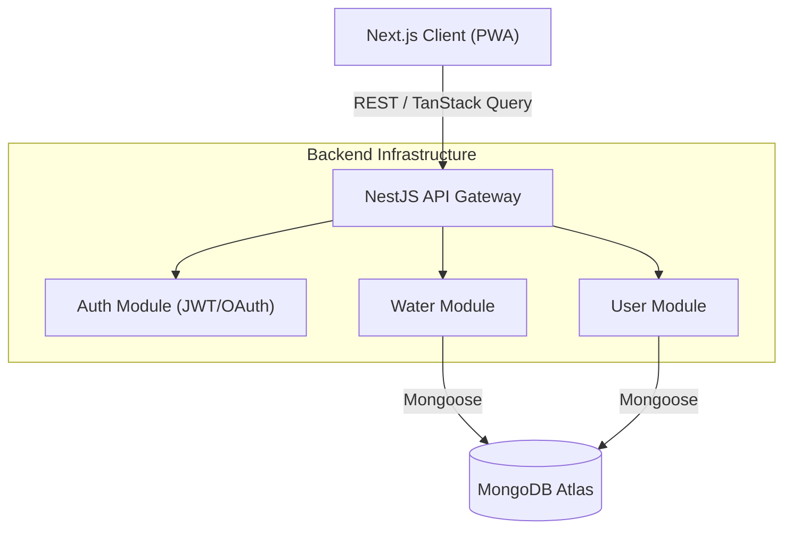

# 💧 HydroTrack

> **A minimalist, timezone-aware hydration tracker designed for night owls and power users.**

[](https://nestjs.com/)
[](https://nextjs.org/)
[](https://web.dev/progressive-web-apps/)
[](https://www.mongodb.com/)
[](LICENSE)

---

## 🖼️ Preview


## 💡 Why HydroTrack?

Most water trackers assume everyone sleeps at midnight. As a developer who often works late, I found that standard apps would reset my progress while I was still awake, breaking my streak and motivation.

**HydroTrack solves this with:**

1.  **Configurable Day Boundaries:** Users can set their "day start" to 4 AM (or any time), ensuring late-night water intake counts towards the _current_ wake cycle.
2.  **Timezone Intelligence:** Auto-detects browser timezones to keep logs accurate even when traveling.
3.  **Zero-Friction UX:** One-tap logging with optimistic UI updates for an app that feels instant.

---

## ✨ Key Features

### 📱 Native-Like Mobile Experience (PWA)

- **Installable:** Fully functional Progressive Web App (PWA) that can be installed on iOS and Android home screens.
- **Offline Capabilities:** Service workers cache core assets, allowing the app to load instantly even on flaky networks.
- **Responsive Design:** Mobile-first UI with touch-friendly controls and pull-to-refresh interactions.

### 🧠 Smart Tracking

- **Night Owl Support:** Configurable "Day Reset" time (e.g., 4:00 AM) handles irregular sleep schedules.
- **Timezone Aware:** Server-side logic respects the user's local time for accurate streaks.
- **Smart Presets:** Customizable 1-tap buttons (100ml - 1000ml) for quick logging.

### 📊 Visual Analytics

- **Interactive Charts:** Tree-shaken **Apache ECharts** for 7-day and monthly trends.
- **Goal Visualization:** Dynamic progress bars and color-coded calendar views.
- **Instant Feedback:** Animated micro-interactions using **Framer Motion**.

### 🛡️ Enterprise-Grade Auth

- **Hybrid Auth:** Support for both Email/Password and **Google OAuth 2.0**.
- **Security:** Bcrypt password hashing, JWT-based stateless sessions, and guarded API routes.

---

## 🏗️ System Architecture

HydroTrack follows a modular, monolithic architecture designed for maintainability and type safety.



---

## 🛠 Tech Stack

| Domain         | Technology Choice           | Rationale                                                           |
| -------------- | --------------------------- | ------------------------------------------------------------------- |
| **Frontend**   | **Next.js 14 (App Router)** | Server Components for performance; SEO optimization.                |
| **Mobile**     | **PWA (Manifest + SW)**     | Native-like experience without app store friction.                  |
| **State**      | **TanStack Query v5**       | Server-state management, caching, and optimistic updates.           |
| **Styling**    | **Tailwind CSS + Lucide**   | Utility-first styling with consistent iconography.                  |
| **Backend**    | **NestJS 10**               | Angular-style dependency injection and modular architecture.        |
| **Database**   | **MongoDB + Mongoose**      | Flexible schema for evolving data; Aggregation pipelines for stats. |
| **Validation** | **class-validator / DTOs**  | Runtime validation to ensure API type safety.                       |

---

## 🚀 Getting Started

### Prerequisites

- **Node.js** ≥ 18
- **MongoDB** (Local or Atlas URI)

### 1. Clone & Install

```bash
git clone [https://github.com/ishanbagchi/water-tracker.git](https://github.com/ishanbagchi/water-tracker.git)
cd water-tracker

```

### 2. Backend Setup

```bash
cd backend
npm install

# Create environment file
cp .env.example .env

```

**Configure `.env`:**

```env
MONGODB_URI=mongodb+srv://<user>:<pass>@cluster.mongodb.net/hydrotrack
JWT_SECRET=super_secret_key_change_me
PORT=4000
FRONTEND_URL=http://localhost:3000

# Google OAuth (Optional)
GOOGLE_CLIENT_ID=...
GOOGLE_CLIENT_SECRET=...
GOOGLE_CALLBACK_URL=http://localhost:4000/api/auth/google/callback

```

Run the server:

```bash
npm run start:dev

```

### 3. Frontend Setup

```bash
cd frontend
npm install
cp .env.example .env.local

```

**Configure `.env.local`:**

```env
NEXT_PUBLIC_API_URL=http://localhost:4000/api

```

Run the client:

```bash
npm run dev

```

---

## 📁 Project Structure

This project follows a strict feature-module structure to ensure scalability.

```
water-tracker/
├── 📂 backend/
│   ├── src/modules/auth/          # Strategies (JWT, Google), Guards
│   ├── src/modules/water/         # Aggregation Pipelines, Services
│   └── src/common/                # Decorators, Filters, Pipes
│
├── 📂 frontend/
│   ├── public/                    # Manifest, Service Worker, icons
│   ├── src/app/                   # Next.js App Router pages
│   ├── src/components/
│   │   ├── ui/                    # Primitive UI components
│   │   └── water/
│   │       ├── water-progress/    # Ring chart (index, components, types, constants)
│   │       ├── entry-list/        # Log entry list (index, components, types)
│   │       ├── stats-panel/       # Stats panel (index, types, constants)
│   │       ├── shared/            # Cross-component constants & primitives
│   │       └── *.tsx              # Other single-file water components
│   ├── src/hooks/                 # Custom React Hooks
│   ├── src/lib/                   # API client & utils
│   └── src/types/                 # Global TypeScript types
│
└── 📄 documentation/
    ├── PRD.md                     # Product Requirements
    └── TRD.md                     # Technical Requirements

```

---

## 🔮 Future Roadmap

- [ ] **Push Notifications:** Smart reminders based on inactivity.
- [ ] **Social Features:** Leaderboards and challenges with friends.
- [ ] **Hydration Factors:** Adjust goals based on weather/activity APIs.
- [ ] **Wearable Integration:** Sync with Apple Health / Google Fit.

---

## 👨‍💻 Author

**Ishan Bagchi** _Frontend Engineer & Minimalist Design Enthusiast_

---

<p align="center">
<i>Built with ❤️, 💧, and lots of caffeine.</i>
</p>
